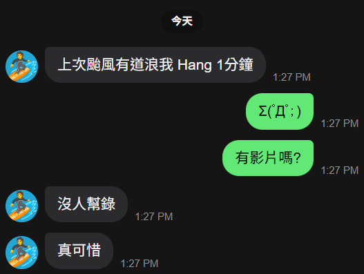

# Shore Spotter - Surf Tracking System🏄🏄🏄 

 > **衝浪攝影不求人**

 > **解放浪人的女友與衝浪教練**

 > **不需帶手機下水**

## 系統架構
### Surfer端
Surfer帶著搭載GPS與傳輸模組的追蹤器持續向岸上攝影站發送座標資料

### 攝影站端
將攝影設備裝在伺服雲台上，攝影站會接收並計算Surfer方位，控制雲台實現自動追蹤

LCD顯示: 連線狀態 / 電量 / 濕度 / GPS狀態 / 監控頁面IP

手機開啟個人熱點，攝影站開機自動連線（熱點 SSID/密碼設定於 `include/wifi_config.h`），再用手機瀏覽器輸入攝影站 IP（開機時 OLED 顯示）即可進入監控頁面

## 為什麼選 LoRa？
衝浪環境對無線通訊有幾個特殊條件：距離遠、無遮蔽物、不適合攜帶手機。LoRa 在這個場景下的優勢在於低功耗與長距離，更重要的是它讓「下水端」的職責單純：只負責定位與傳輸，不需要維護網路連線。

相比藍牙或 WiFi，LoRa 在開放水域場域的穿透性與覆蓋距離更有優勢；相比帶手機或智慧手錶，這套設備的任務邊界更清晰，也更好做防水設計。

[LoRa 封包與攝影站 API](docs/interface.md)\
[韌體功能說明](docs/features.md)

## 未來目標
+ 多Surfer追蹤
+ Auto Record\
  結合GPS路徑或影像分析，偵測「追浪」與「起程」事件，讓錄影自動觸發，不再依賴手動操作。

+ 純影像追蹤，不需要攜帶追蹤器\
  岸上相機透過影像追蹤自動鎖定目標。從「GPS 輔助追蹤」演進為「完全被動」的使用體驗——這也是整個系統最終想到達的地方。
