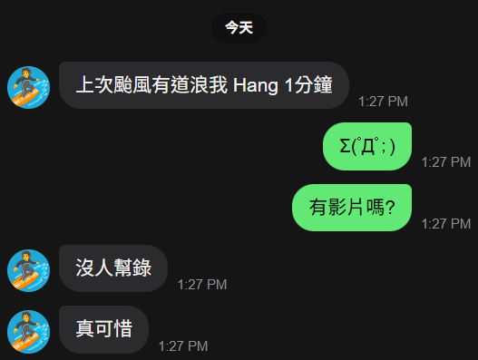

# Shore Spotter - Surf Tracking System🏄🏄🏄 

 > **衝浪攝影不求人**

 > **解放浪人的女友與衝浪教練**

 > **不需帶手機下水**

## 系統架構
### Surfer端
Surfer帶著搭載GPS與傳輸模組的追蹤器持續向岸上攝影站發送座標資料

### 攝影站端
將攝影設備裝在伺服雲台上，攝影站會接收並計算Surfer方位，控制雲台實現自動追蹤

LCD顯示: 連線狀態 / 電量 / 濕度 / GPS狀態 / 監控頁面IP

手機開啟個人熱點，攝影站開機自動連線（熱點 SSID/密碼設定於 `include/wifi_config.h`），再用手機瀏覽器輸入攝影站 IP（開機時 OLED 顯示）即可進入監控頁面

## 怎麼分 client / server
這個專案不是用序列埠來分角色，而是用 `platformio.ini` 裡的 PlatformIO environment 來分：

+ `tbeam-client` = Surfer 端追蹤器，對應 `ROLE_CLIENT`
+ `tbeam-server` = 岸邊攝影站，對應 `ROLE_SERVER`

燒錄哪塊板、走哪個 `upload_port`，看的是你執行 `pio run -e tbeam-client` 還是 `-e tbeam-server`（或 VS Code 下方切換 environment），跟埠號本身無關。

`upload_port` / `monitor_port` 依作業系統手動指定即可，`platformio.ini` 裡每個 environment 下面都留了 Windows（`COMx`）與 Linux（`/dev/ttyACM*` 或 `/dev/ttyUSB*`）的範例，要用哪個就拿掉那兩行前面的 `;`、其餘保持註解。同時插兩塊板時，先用 `ls /dev/tty*`（Linux）確認各板實際對應的裝置名稱，再分別填進 `tbeam-client` / `tbeam-server` 對應的 environment。

## 跑測試

指向計算（角度環繞、方位角、磁力計圓擬合）與現場提醒的門檻都抽在
`include/geo_math.h` / `include/alerts.h`，兩個檔案都不依賴 Arduino，所以可以在筆電上直接驗：

```bash
pio test -e native
```

這些函式的共同特性是「算錯了不會有任何錯誤訊息」，而在板子上驗證它們的唯一辦法是人站在
腳架旁邊轉一圈，所以特別值得有測試。

## Server 透過 Wi-Fi 更新（PlatformIO espota）

第一次必須用 `tbeam-server` 經 USB 燒錄，讓板子取得 OTA 功能。之後電腦與 Server 連在同一個手機熱點時，可使用 `tbeam-server-ota`：

```bash
pio run -e tbeam-server-ota -t upload
```

預設以 `shore-spotter-server.local` 尋找裝置。若手機熱點不轉送 mDNS，改用 OLED 顯示的 IP：

```bash
pio run -e tbeam-server-ota -t upload --upload-port <SERVER_IP>
```

更新期間請維持供電與 Wi-Fi 穩定。OTA 開始時會暫停自動追蹤，成功後 Server 自動重開；USB 燒錄仍保留作為救援方式。OTA 本身未設密碼，任何連上同一熱點且能連到 Server 的裝置都能送出韌體，因此不要讓不受信任的裝置加入熱點。監控頁 API 與 LoRa 封包也是同樣的取捨（都刻意沒做存取控制），完整說明見 [interface.md 的存取控制一節](docs/interface.md#監控頁與-ota-的存取控制)。

## 為什麼選 LoRa？
衝浪環境對無線通訊有幾個特殊條件：距離遠、無遮蔽物、不適合攜帶手機。LoRa 在這個場景下的優勢在於低功耗與長距離，更重要的是它讓「下水端」的職責單純：只負責定位與傳輸，不需要維護網路連線。

相比藍牙或 WiFi，LoRa 在開放水域場域的穿透性與覆蓋距離更有優勢；相比帶手機或智慧手錶，這套設備的任務邊界更清晰，也更好做防水設計。

[LoRa 封包與攝影站 API](docs/interface.md)\
[韌體功能說明](docs/features.md)

## 未來目標
+ 多Surfer追蹤
+ Auto Record\
  結合GPS路徑或影像分析，偵測「追浪」與「起程」事件，讓錄影自動觸發，不再依賴手動操作。

+ 純影像追蹤，不需要攜帶追蹤器\
  岸上相機透過影像追蹤自動鎖定目標。從「GPS 輔助追蹤」演進為「完全被動」的使用體驗——這也是整個系統最終想到達的地方。
