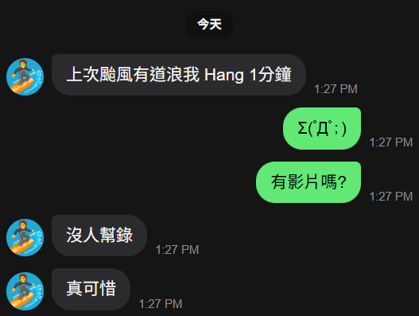

# Shore Spotter - Surf Tracking System🏄🏄🏄 

目前原始碼版本：**0.6-dev（未發行）**。版本唯一來源為 [firmware_version.h](include/firmware_version.h)，
發版紀錄見 [CHANGELOG.md](CHANGELOG.md)。Client／Station 共用版本號，開機 OLED 與
序列紀錄顯示版本；Station 網頁「資訊 → 站專屬」及 `/api/status` 的
`health.firmware_version` 顯示板上實際版本。舊 Client 不會因 Station 更新而自動更新。

本版使用 LoRa v5：SF10、單向傳送、位置封包 **18 bytes**，最新有效定位在無線電空閒時即送，
使用完整 E7 座標（約 1 公分數值解析度）、速度與方向；DATA 不帶來源資料年齡。相同定位不重傳，失效只通知一次；
約 60 秒的 LoRa 診斷獨立發送，可能偶爾延後一筆定位。
雙端 GPS 設為 **115200／2 Hz 的 RMC＋GGA 驗證版**；這組合超出 L76K 原廠高頻模式的
單語句前提，須看實測 epoch／RMC／GGA 頻率及缺語句，尚未通過實機驗收。
**與 v3 不相容；SF9 舊板無法與 SF10 通訊，Client、Station 必須一起更新。**
本版還使用 DIAG 原保留的 bits6／7，舊 Station 會拒收這種 DIAG；DATA 長度不變。
Station 插卡後自動記錄逐包 LoRa、文字與每秒快照，USB 匯出見 [SD 記錄](docs/sd-log.md)。
網頁只保留雷達／資訊；移除 GPX、Strava 與除錯錄製。診斷 HTTP API 仍可使用，見
[現場除錯](docs/debug-export.md)。Axiom 可透過既有 API 設定，預設關閉，見 [Axiom](docs/axiom-log.md)。

Axiom 需自行建立 dataset／ingest Token，忙碌或斷網可能遺失紀錄。


 > **衝浪攝影不求人**

 > **解放浪人的女友與衝浪教練**

 > **不需帶手機下水**

## 系統架構
### Surfer端
Surfer帶著搭載GPS與傳輸模組的追蹤器持續向岸上攝影站發送座標資料

### 攝影站端
將攝影設備裝在伺服雲台上，攝影站會接收並計算Surfer方位，控制雲台實現自動追蹤

LCD顯示: 連線狀態 / 電量 / 濕度 / GPS狀態 / 監控頁面IP

手機開啟個人熱點，攝影站開機自動連線（熱點 SSID/密碼設定於 `include/wifi_config.h`），再用手機瀏覽器輸入攝影站 IP（開機時 OLED 顯示）即可進入監控頁面

## 怎麼分 client / station
這個專案不是用序列埠來分角色，而是用 `platformio.ini` 裡的 PlatformIO environment 來分：

+ `tbeam-client` = Surfer 端追蹤器，對應 `ROLE_CLIENT`
+ `tbeam-station` = 岸邊攝影站，對應 `ROLE_STATION`

燒錄哪塊板、走哪個 `upload_port`，看的是你執行 `pio run -e tbeam-client` 還是 `-e tbeam-station`（或 VS Code 下方切換 environment），跟埠號本身無關。

`upload_port` / `monitor_port` 依作業系統指定，設定檔保留 Windows 與 Linux 範例。
先用 `pio device list` 核對 USB 序號／晶片 MAC，再依開機紀錄確認角色；埠號會隨插拔改變，
不能只用 ACM0／ACM1 判定。上傳時可用 `--upload-port <實際埠號>` 覆蓋設定。

## 跑測試

指向計算（角度環繞、方位角、保留的圓擬合數學）與現場提醒的門檻都抽在
`include/geo_math.h` / `include/alerts.h`；GPS/UART 模式隔離與控制核心放在
`include/tracking_policy.h` / `include/servo_motion.h`，都不依賴 Arduino，可在筆電驗證：

```bash
pio test -e native
node tools/test_servo_slider.js
node tools/test_motion_ui.js
node tools/test_debug_ui.js
python3 tools/test_motion_backend.py
python3 tools/test_packet_backend.py
python3 tools/test_radio_power.py
python3 tools/test_debug_backend.py
```

native 測試涵蓋 GPS／UART 模式隔離、SET 解析、watchdog、非阻塞 TX、client 綁定、磁偏角與
既有數學／提醒，以及 v5 codec、同 epoch GNSS 與無線排程；Node 測試執行實際頁面，
模擬時鐘與 HTTP 回覆；Python 工具擷取實際 C++ 後端驗證控制、封包與除錯 JSON。
實機驗證結果與待處理問題見 [最新健檢紀錄](docs/health-check-2026-09-08.md)。

## Station 透過 Wi-Fi 更新（PlatformIO espota）

第一次必須用 `tbeam-station` 經 USB 燒錄，讓板子取得 OTA 功能。之後電腦與 Station 連在同一個手機熱點時，可使用 `tbeam-station-ota`：

```bash
pio run -e tbeam-station-ota -t upload
```

預設使用 `platformio.ini` 的 `upload_port`。現場 IP 有變時，以 OLED 顯示的 IP 覆蓋：

```bash
pio run -e tbeam-station-ota -t upload --upload-port <STATION_IP>
```

更新期間請維持供電與 Wi-Fi 穩定。OTA 開始時會暫停自動追蹤，成功後 Station 自動重開；USB 燒錄仍保留作為救援方式。OTA 本身未設密碼，任何連上同一熱點且能連到 Station 的裝置都能送出韌體，因此不要讓不受信任的裝置加入熱點。監控頁 API 與 LoRa 封包也是同樣的取捨（都刻意沒做存取控制），完整說明見 [interface.md 的存取控制一節](docs/interface.md#監控頁與-ota-的存取控制)。

## GPS / UART 獨立模式與指南針校正

`tbeam-station` 開機 Servo 90°、預設手動模式。網頁選「手動／GPS／UART」；
GPS 與 UART 控制互斥，不會自動切換來源。GPS 失效轉完最後有效目標後保持；UART 過期立即保持。
GPS 在兩端定位有效且新資料未滿 2 秒時允許選取；品質差只警告，速度外推另受品質限制；追蹤採用預設 90°有效校正並要求有效磁偏角，條件恢復即於下個控制週期追蹤，沒有額外 2 秒等待；UART 只需持續 UART `SET`，
不需要 ARM，也不再接受 STOP。250 ms 無有效 SET 則保持，新指令可直接恢復。

GPS／UART／手動共用微秒實際時間軌跡，Servo 更新不限頻；GPS 目標重算維持 20 Hz；外圈角度控制拖動只預覽，放開才送出。
UI 左 0°、右 180° 對應內部 180°、0°，HTTP／UART 角度協定不變。
所有模式只共用一個最高速度限制，預設 **30°/秒**。「資訊」頁可調 **1–90°/秒**，
修改後自動儲存，重開機讀回上次值；沒有加速度、jerk、死區或頻率調參。
資訊頁另有「GPS 位置預測（α）」開關；逐包與詳細狀態由 SD 記錄。
HTTP 控制仍需世代／序號／期限；升級後請重整網頁。
完整操作見 [共用控制器](docs/motion-control.md)。開機首次回 90° 無位置回饋，無法保證平滑速度。

GPS 鏡頭校正只存 RAM；須先回到 Servo 90° 並停穩，非 90° 或移動中會通知並拒絕校正。
「回到 90°」切為手動並按共用速限回中；北填 0°、東 90°、南 180°、西 270°，其他方向填普通磁針實際讀數。
校正不需兩端 GPS；完成後再選 GPS 追蹤。
板上磁力計與 hard-iron 已停用，不讀寫校正 NVS。開機採用 90°有效偏移；手動校正只保留於 RAM，重開機回復 90°。腳架方向與此參考不同時可重新校正。
台灣磁偏角依攝影站 GPS 位置與日期自動補償，WMM2025 適用 2025–2029 年。
UART 不受 GPS 品質或校正狀態影響。

只綁定一個 GPS client，保留共用封包與 ClientState 供未來擴充。
Client 非阻塞發送，Station 持續接收且不回 ACK；HTTP／感測器耗時與最大服務間隔可由
`/api/status` 的 `timing` 查看，不增加逐次 log。I2C 每筆交易 timeout 為 10 ms。

HTTP track/stop 與板上校正 API 已移除；切到手動可停止全部自動追蹤。
UART 控制端（例如 Jetson）走 USB-to-TTL GPIO UART；UDP 控制已移除，Wi-Fi 網頁與 OTA 保留。
模式 API 使用 `mode=uart`；舊 `mode=jetson` 仍可輸入，但回應統一為 `uart`。
接線、操作與相容性見 [docs/uart-servo.md](docs/uart-servo.md)。

## 為什麼選 LoRa？
衝浪環境對無線通訊有幾個特殊條件：距離遠、無遮蔽物、不適合攜帶手機。LoRa 在這個場景下的優勢在於低功耗與長距離，更重要的是它讓「下水端」的職責單純：只負責定位與傳輸，不需要維護網路連線。

相比藍牙或 WiFi，LoRa 在開放水域場域的穿透性與覆蓋距離更有優勢；相比帶手機或智慧手錶，這套設備的任務邊界更清晰，也更好做防水設計。

[LoRa 封包與攝影站 API](docs/interface.md)\
[韌體功能說明](docs/features.md)\
[網頁設計規格（修改 UI 前必讀）](docs/web-ui-design.md)

## 未來目標
+ 多Surfer追蹤
+ Auto Record\
  結合GPS路徑或影像分析，偵測「追浪」與「起程」事件，讓錄影自動觸發，不再依賴手動操作。

+ 純影像追蹤，不需要攜帶追蹤器\
  岸上相機透過影像追蹤自動鎖定目標。從「GPS 輔助追蹤」演進為「完全被動」的使用體驗——這也是整個系統最終想到達的地方。

## L76K 外測診斷版

使用 `tbeam-client-diagnostic`／`tbeam-station-diagnostic`，以內建 Flash 保存原始 GNSS、時間與重啟原因，外測不需要筆電。流程、容量限制與 USB 匯出見 [field-diagnostic.md](docs/field-diagnostic.md)。普通韌體仍使用原 2 Hz 設定。
