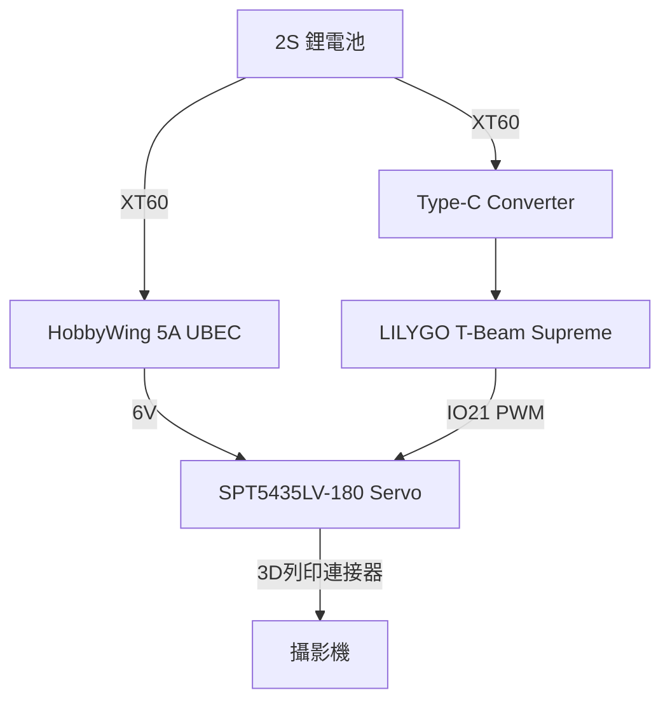

# 硬體說明（Hardware）

本文件彙整 Shore Spotter 的硬體規格與接線：

1. **腳位圖（Pins Map）** — T-Beam Supreme GPIO 分配
2. **I2C 裝置位址** — OLED / 感測器 / PMU
3. **電氣參數與電源通道** — AXP2101 各路供電
4. **按鈕說明** — PWR / BOOT / RST
5. **Servo 規格** — SPT5435LV-180
6. **接線圖** — 電池 / UBEC / Servo / 攝影機

韌體行為見 [features.md](features.md)；封包/HTTP 介面見 [interface.md](interface.md)。

---

# LILYGO T-Beam Supreme - V3.0 / L76K / 915mhz / SX1262
### 📍 Pins Map

| Name                                         | GPIO NUM                   | Free |
| -------------------------------------------- | -------------------------- | ---- |
| Uart1 TX                                     | 43(External QWIIC Socket)  | ✅️    |
| Uart1 RX                                     | 44(External QWIIC Socket)  | ✅️    |
| SDA                                          | 17                         | ❌    |
| SCL                                          | 18                         | ❌    |
| OLED(**SH1106**) SDA                         | Share with I2C bus         | ❌    |
| OLED(**SH1106**) SCL                         | Share with I2C bus         | ❌    |
| RTC(**PCF8563**) SDA                         | Share with **PMU** I2C bus | ❌    |
| RTC(**PCF8563**) SCL                         | Share with **PMU** I2C bus | ❌    |
| MAG Sensor(**QMC6310U/QMC6310N/QC6309**) SDA | Share with I2C bus         | ❌    |
| MAG Sensor(**QMC6310U/QMC6310N/QC6309**) SCL | Share with I2C bus         | ❌    |
| RTC(**PCF8563**) Interrupt                   | 14                         | ❌    |
| IMU Sensor(**QMI8658**) Interrupt            | 33                         | ❌    |
| IMU Sensor(**QMI8658**) MISO                 | Share with SPI bus         | ❌    |
| IMU Sensor(**QMI8658**) MOSI                 | Share with SPI bus         | ❌    |
| IMU Sensor(**QMI8658**) SCK                  | Share with SPI bus         | ❌    |
| IMU Sensor(**QMI8658**) CS                   | 34                         | ❌    |
| SPI MOSI                                     | 35                         | ❌    |
| SPI MISO                                     | 37                         | ❌    |
| SPI SCK                                      | 36                         | ❌    |
| SD CS                                        | 47                         | ❌    |
| SD MOSI                                      | Share with SPI bus         | ❌    |
| SD MISO                                      | Share with SPI bus         | ❌    |
| SD SCK                                       | Share with SPI bus         | ❌    |
| GNSS(**L76K or Ublox M10**) TX               | 8                          | ❌    |
| GNSS(**L76K or Ublox M10**) RX               | 9                          | ❌    |
| GNSS(**L76K or Ublox M10**) PPS              | 6                          | ❌    |
| GNSS(**L76K**) Wake-up                       | 7                          | ❌    |
| LoRa(**SX1262 or LR1121**) SCK               | 12                         | ❌    |
| LoRa(**SX1262 or LR1121**) MISO              | 13                         | ❌    |
| LoRa(**SX1262 or LR1121**) MOSI              | 11                         | ❌    |
| LoRa(**SX1262 or LR1121**) RESET             | 5                          | ❌    |
| LoRa(**SX1262 or LR1121**) DIO1/DIO9         | 1                          | ❌    |
| LoRa(**SX1262 or LR1121**) BUSY              | 4                          | ❌    |
| LoRa(**SX1262 or LR1121**) CS                | 10                         | ❌    |
| Button1 (BOOT)                               | 0                          | ❌    |
| PMU (**AXP2101**) IRQ                        | 40                         | ❌    |
| PMU (**AXP2101**) SDA                        | 42                         | ❌    |
| PMU (**AXP2101**) SCL                        | 41                         | ❌    |

> \[!IMPORTANT]
> 
> 1. GNSS Wake-up is only available in L76K version
> 
> 2. Radio has its own SPI bus, and other peripheral SPI devices share the SPI bus.
>
> 3. T-BeamSupreme has three magnetometer versions: QMC6310N, QMC6310U, and QMC6309, each with a different device address.

### 🧑🏼‍🔧 I2C Devices Address

| Devices                                 | 7-Bit Address | Share Bus      |
| --------------------------------------- | ------------- | -------------- |
| OLED Display (**SH1106**)               | 0x3C/0x3D     | ✅️  (I2C Bus 0) |
| MAG Sensor(**QMC6310U OR QMC6310N**)    | 0x1C/0x3C     | ✅️  (I2C Bus 0) |
| MAG Sensor(**QMC6309**)                 | 0x7C          | ✅️  (I2C Bus 0) |
| Temperature/humidity Sensor(**BME280**) | 0x77          | ✅️  (I2C Bus 0) |
| RTC (**PCF8563**)                       | 0x51          | ❌ (I2C Bus 1)  |
| Power Manager (**AXP2101**)             | 0x34          | ❌ (I2C Bus 1)  |

> \[!IMPORTANT]
> If the I2C device is connected to pins 17 (SDA) or 18 (SCL)
> the sensor power supply must be connected to DC1. If connected to other LDOs
> the power must be turned on before accessing the sensor I2C bus
> otherwise, the I2C access will fail or freeze.
>
> The QMC6310U and QMC6310N use different device addresses: QMC6310U (0x1C) and QMC6310N (0x3C).
> The SH1106 uses either device address 0x3C or 0x3D. If using the QMC6310U version, the device address is 0x3C; if using the QMC6310N version, the device address is 0x3D.
> The screen device address using the QMC6309 magnetic sensor is 0x3C, the same as the QMC6310U.
>

### BME280 Address

* If you need to change the BME280 device address, you can remove the resistor and then connect it to the fixed pad via a wire. This will change the device address to 0x76.

### ⚡ Electrical parameters

| Features             | Details                     |
| -------------------- | --------------------------- |
| 🔗USB-C Input Voltage | 3.9V-6V                     |
| ⚡Charge Current      | 0-1024mA (\(Programmable\)) |
| 🔋Battery Voltage     | 3.7V                        |

### ⚡ PowerManage Channel

| Channel    | Peripherals                              | Max Current                              |
| ---------- | ---------------------------------------- | ---------------------------------------- |
| DC1        | **ESP32-S3**                             | 2A(Includes ESP operating current 800mA) |
| DC2        | Unused                                   | X                                        |
| DC3        | External M.2 Socket                      | 2A                                       |
| DC4        | External M.2 Socket                      | 1.5A                                     |
| DC5        | External M.2 Socket                      | 1A                                       |
| LDO1(VRTC) | Unused                                   | X                                        |
| ALDO1      | **BME280 Sensor & Display & MAG Sensor** | 300mA                                    |
| ALDO2      | **Sensor**                               | 300mA                                    |
| ALDO3      | **Radio**                                | 300mA                                    |
| ALDO4      | **GPS**                                  | 300mA                                    |
| BLDO1      | **SD Card**                              | 300mA                                    |
| BLDO2      | External pin header                      | 300mA                                    |
| DLDO1      | Unused                                   | X                                        |
| CPUSLDO    | Unused                                   | X                                        |
| VBACKUP    | Unused                                   | X                                        |

* T-Beam Supreme GPS backup power comes from 18650 battery. If you remove the 18650 battery, you will not be able to get GPS hot start. If you need to use GPS hot start, please connect the 18650 battery.

### Button Description

| Channel | Peripherals                       |
| ------- | --------------------------------- |
| PWR     | PMU button, customizable function |
| BOOT    | Boot mode button, customizable    |
| RST     | Reset button                      |

* The PWR button is connected to the PMU
  1. In shutdown mode, press the PWR button to turn on the power supply
  2. In power-on mode, press the PWR button for 6 seconds (default time) to turn off the power supply

> 韌體用法（本專案）：Client 端**短按 PWR** 喚醒 OLED 顯示狀態 10 秒；**長按 PWR** 顯示關機畫面後由 PMU 斷電。Server 端長按 PWR 同樣為關機。

# SPT5435LV -180
| Parameter             |               Value | Parameter             |                Value |
| --------------------- | ------------------: | --------------------- | -------------------: |
| Brand                 |           SPT Servo | Potentiometer         |            Mechanics |
| Motor                 |                Core | Voltage Range         |          4.8V / 6.0V |
| Neutral Point         |              1500μs | Signal Frequency      |                330Hz |
| PWM Voltage           |           3.3V–5.0V | PWM Voltage           |            3.3V–5.0V |
| Feedback Angle        |                  No | Operating Temperature |           -10°C–50°C |
| Cycle                 |                20ms | Dead band             |                  4μs |
| Default Direction     |                 CCW | Yes / no Lock         |                 Lock |
| Remote control Angle  |                 90° | 500–2500μs Angle      |           180° / PWM |
| Quiescent Current     |              100mAh | Rated Current         |                 1.4A |
| Blocking Current      |                3.5A | Weight / Dimensions   | 60g / 40.5×20×40.5mm |
| Output Gear           |          Futaba 25T | Gear Material         |       All Metal Gear |
| Shell Material        | Half Aluminum Shell | Bearing               |                  2BB |
| Connector Wire Length |               260MM | Line Definition       | Brown-/Red+/Orange S |
| Operating Speed       |  4.8V / 0.16″ / 60° | Operating Speed       |   6.0V / 0.14″ / 60° |
| Stall Torque          |     4.8V / 29 kg.cm | Stall Torque          |      6.0V / 35 kg.cm |

# 接線圖

