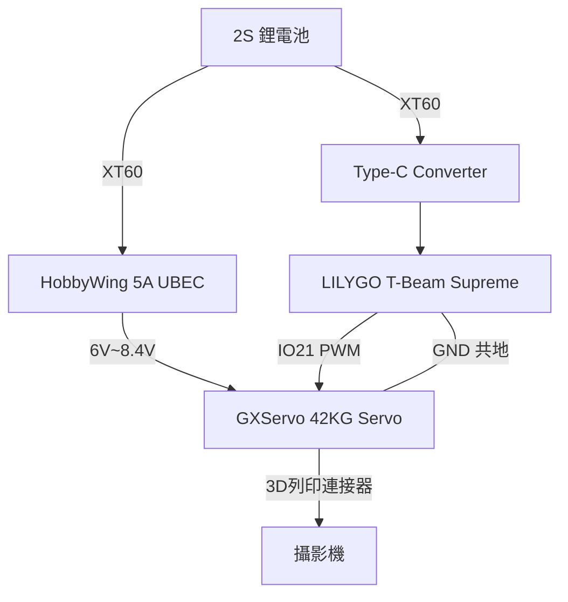

# 硬體說明（Hardware）

本文件彙整 Shore Spotter 的硬體規格與接線：

1. **腳位圖（Pins Map）** — T-Beam Supreme GPIO 分配
2. **I2C 裝置位址** — OLED / 感測器 / PMU
3. **電氣參數與電源通道** — AXP2101 各路供電
4. **按鈕說明** — PWR / BOOT / RST
5. **Servo 規格** — GXServo Brushless 42KG (QY3242BLS / GX3242)
6. **磁力計擺放要求** — QMC6310 的固定位置、擺放方向、與 servo 的距離
7. **接線圖** — 電池 / UBEC / Servo / 攝影機

韌體行為見 [features.md](features.md)；封包/HTTP 介面見 [interface.md](interface.md)。

---

# LILYGO T-Beam Supreme - V3.0 / L76K / 915mhz / SX1262
### 📍 Pins Map

| Name                                         | GPIO NUM                   | Free |
| -------------------------------------------- | -------------------------- | ---- |
| Uart1 TX                                     | 43(External QWIIC Socket)  | ✅️    |
| Uart1 RX                                     | 44(External QWIIC Socket)  | ✅️    |
| SDA                                          | 17                         | ❌    |
| SCL                                          | 18                         | ❌    |
| OLED(**SH1106**) SDA                         | Share with I2C bus         | ❌    |
| OLED(**SH1106**) SCL                         | Share with I2C bus         | ❌    |
| RTC(**PCF8563**) SDA                         | Share with **PMU** I2C bus | ❌    |
| RTC(**PCF8563**) SCL                         | Share with **PMU** I2C bus | ❌    |
| MAG Sensor(**QMC6310U/QMC6310N/QC6309**) SDA | Share with I2C bus         | ❌    |
| MAG Sensor(**QMC6310U/QMC6310N/QC6309**) SCL | Share with I2C bus         | ❌    |
| RTC(**PCF8563**) Interrupt                   | 14                         | ❌    |
| IMU Sensor(**QMI8658**) Interrupt            | 33                         | ❌    |
| IMU Sensor(**QMI8658**) MISO                 | Share with SPI bus         | ❌    |
| IMU Sensor(**QMI8658**) MOSI                 | Share with SPI bus         | ❌    |
| IMU Sensor(**QMI8658**) SCK                  | Share with SPI bus         | ❌    |
| IMU Sensor(**QMI8658**) CS                   | 34                         | ❌    |
| SPI MOSI                                     | 35                         | ❌    |
| SPI MISO                                     | 37                         | ❌    |
| SPI SCK                                      | 36                         | ❌    |
| SD CS                                        | 47                         | ❌    |
| SD MOSI                                      | Share with SPI bus         | ❌    |
| SD MISO                                      | Share with SPI bus         | ❌    |
| SD SCK                                       | Share with SPI bus         | ❌    |
| GNSS(**L76K or Ublox M10**) TX               | 8                          | ❌    |
| GNSS(**L76K or Ublox M10**) RX               | 9                          | ❌    |
| GNSS(**L76K or Ublox M10**) PPS              | 6                          | ❌    |
| GNSS(**L76K**) Wake-up                       | 7                          | ❌    |
| LoRa(**SX1262 or LR1121**) SCK               | 12                         | ❌    |
| LoRa(**SX1262 or LR1121**) MISO              | 13                         | ❌    |
| LoRa(**SX1262 or LR1121**) MOSI              | 11                         | ❌    |
| LoRa(**SX1262 or LR1121**) RESET             | 5                          | ❌    |
| LoRa(**SX1262 or LR1121**) DIO1/DIO9         | 1                          | ❌    |
| LoRa(**SX1262 or LR1121**) BUSY              | 4                          | ❌    |
| LoRa(**SX1262 or LR1121**) CS                | 10                         | ❌    |
| Button1 (BOOT)                               | 0                          | ❌    |
| PMU (**AXP2101**) IRQ                        | 40                         | ❌    |
| PMU (**AXP2101**) SDA                        | 42                         | ❌    |
| PMU (**AXP2101**) SCL                        | 41                         | ❌    |

> \[!IMPORTANT]
> 
> 1. GNSS Wake-up is only available in L76K version
> 
> 2. Radio has its own SPI bus, and other peripheral SPI devices share the SPI bus.
>
> 3. T-BeamSupreme has three magnetometer versions: QMC6310N, QMC6310U, and QMC6309, each with a different device address.

### 🧑🏼‍🔧 I2C Devices Address

| Devices                                 | 7-Bit Address | Share Bus      |
| --------------------------------------- | ------------- | -------------- |
| OLED Display (**SH1106**)               | 0x3C/0x3D     | ✅️  (I2C Bus 0) |
| MAG Sensor(**QMC6310U OR QMC6310N**)    | 0x1C/0x3C     | ✅️  (I2C Bus 0) |
| MAG Sensor(**QMC6309**)                 | 0x7C          | ✅️  (I2C Bus 0) |
| Temperature/humidity Sensor(**BME280**) | 0x77          | ✅️  (I2C Bus 0) |
| RTC (**PCF8563**)                       | 0x51          | ❌ (I2C Bus 1)  |
| Power Manager (**AXP2101**)             | 0x34          | ❌ (I2C Bus 1)  |

> \[!IMPORTANT]
> If the I2C device is connected to pins 17 (SDA) or 18 (SCL)
> the sensor power supply must be connected to DC1. If connected to other LDOs
> the power must be turned on before accessing the sensor I2C bus
> otherwise, the I2C access will fail or freeze.
>
> The QMC6310U and QMC6310N use different device addresses: QMC6310U (0x1C) and QMC6310N (0x3C).
> The SH1106 uses either device address 0x3C or 0x3D. If using the QMC6310U version, the device address is 0x3C; if using the QMC6310N version, the device address is 0x3D.
> The screen device address using the QMC6309 magnetic sensor is 0x3C, the same as the QMC6310U.
>

> [!NOTE]
> **韌體會自己判斷是哪一版。** `initMag()` 先探測 0x1C（QMC6310U），探到就用螢幕 0x3C；
> 否則探測 0x3C（QMC6310N），探到就把螢幕改成 0x3D。開機 log 會印出實際使用的兩個位址：
> `[MAG] QMC6310 init ok at 0x1C -> OLED at 0x3C`。
>
> 順序不能反過來：在 U 版板子上 0x3C 是螢幕，對它送磁力計的探測寫入毫無意義。

### BME280 Address

* If you need to change the BME280 device address, you can remove the resistor and then connect it to the fixed pad via a wire. This will change the device address to 0x76.


### ⚡ Electrical parameters

| Features             | Details                     |
| -------------------- | --------------------------- |
| 🔗USB-C Input Voltage | 3.9V-6V                     |
| ⚡Charge Current      | 0-1024mA (\(Programmable\)) |
| 🔋Battery Voltage     | 3.7V                        |

### ⚡ PowerManage Channel

| Channel    | Peripherals                              | Max Current                              |
| ---------- | ---------------------------------------- | ---------------------------------------- |
| DC1        | **ESP32-S3**                             | 2A(Includes ESP operating current 800mA) |
| DC2        | Unused                                   | X                                        |
| DC3        | External M.2 Socket                      | 2A                                       |
| DC4        | External M.2 Socket                      | 1.5A                                     |
| DC5        | External M.2 Socket                      | 1A                                       |
| LDO1(VRTC) | Unused                                   | X                                        |
| ALDO1      | **BME280 Sensor & Display & MAG Sensor** | 300mA                                    |
| ALDO2      | **Sensor**                               | 300mA                                    |
| ALDO3      | **Radio**                                | 300mA                                    |
| ALDO4      | **GPS**                                  | 300mA                                    |
| BLDO1      | **SD Card**                              | 300mA                                    |
| BLDO2      | External pin header                      | 300mA                                    |
| DLDO1      | Unused                                   | X                                        |
| CPUSLDO    | Unused                                   | X                                        |
| VBACKUP    | Unused                                   | X                                        |

* T-Beam Supreme GPS backup power comes from 18650 battery. If you remove the 18650 battery, you will not be able to get GPS hot start. If you need to use GPS hot start, please connect the 18650 battery.

### Button Description

| Channel | Peripherals                       |
| ------- | --------------------------------- |
| PWR     | PMU button, customizable function |
| BOOT    | Boot mode button, customizable    |
| RST     | Reset button                      |

* The PWR button is connected to the PMU
  1. In shutdown mode, press the PWR button to turn on the power supply
  2. In power-on mode, press the PWR button for 6 seconds (default time) to turn off the power supply

> 韌體用法（本專案）：Client 端**短按 PWR** 喚醒 OLED 顯示狀態 10 秒；**長按 PWR** 顯示關機畫面後由 PMU 斷電。Server 端長按 PWR 同樣為關機。

# GXServo Brushless 42KG (QY3242BLS / GX3242)

> 本專案目前使用：**500–2500us, 180°**（與韌體 `SERVO_MIN_US=500`, `SERVO_MAX_US=2500` 對應）。

> [!IMPORTANT]
> **旋轉方向：實機已確認為「角度增加 = 從上方看逆時針」**，與韌體追蹤公式的假設一致
> （`world_bearing = mag_heading − servo_angle + mount_offset`，見 `main.cpp` 幾何註解）。
>
> 這件事踩過一次，所以 NVS 存的校正值帶版本號 `SERVO_CAL_VERSION`（目前 v2 = 逆時針正向）。
> 若日後把 servo 上下顛倒重裝，方向會反轉，追蹤會往錯的方向跑（surfer 往左、鏡頭往右），
> 而且**不會有任何錯誤訊息**。重裝機構後請務必重驗：
>
> 手動模式把滑桿從 90 拉到 120，從上方看相機應該**逆時針**轉。若變成順時針，
> 就要翻轉 servo 或在公式裡反號，並同時 bump `SERVO_CAL_VERSION` 讓舊校正值失效。

| Parameter | Value |
| --- | --- |
| 型號 | GXServo QY3242BLS / GX3242（42KG 級） |
| 馬達型式 | Brushless |
| 操作電壓 | 5.0V–8.4V |
| 控制訊號 | PWM, 1520us / 333Hz（常見標示） |
| PWM 輸入電平 | 3.3V–5.0V |
| 脈寬/角度 | 500–2500us 對應 180° |
| 堵轉扭力 | 30 kg.cm @ 6.0V / 38 kg.cm @ 7.4V / 42 kg.cm @ 8.4V |
| 空載速度 | 0.118s/60° @ 6.0V / 0.092s/60° @ 7.4V / 0.085s/60° @ 8.4V |
| Dead band | 2us |
| 防護 | IP65（依賣場標示） |
| 齒輪/軸承 | 金屬齒輪（常見為銅鋁組合）/ 雙滾珠 |
| 尺寸/重量 | 約 40 x 20 x 37mm / 約 69g |
| 線材 | Brown(-) / Red(+) / Orange(Signal) |

> [!IMPORTANT]
> 1. GXServo 42KG 在不同通路會有標示差異（例如殼材、齒輪材質、是否可程式化、角度選項）。
> 2. 本專案以 **180° 版本 + 500–2500us** 為準，若你買到 270/360° 版本，需重新校正行程。
> 3. 若使用 2S 電池，請先經 UBEC/穩壓供電給 Servo，不要直接把 2S 接到 servo 電源腳。
> 4. Servo Brown(-)、UBEC GND 與 T-Beam GND 必須共地；只接 IO21 訊號線無法形成有效的 PWM 電位基準。

資料來源（2026-07-23 查詢）：
- https://www.ariesrc.gr/en/servo-4/22326-gxservo-qy3242bls-42kg-brushless-motor-180-degree-metal-gear-digital-servo-for-rc.html
- https://hobbyant.com/p/sale-268576
- https://offthegridsun.com/Servo-Robot-Motor/GXservo-GX3242-42KG-Brushless-Steering-Gear-High-Speed-Servo

# 磁力計（QMC6310）擺放要求

板上 QMC6310 提供「攝影站站體航向」，用來補償腳架被撞動或轉動。追蹤公式是

```
mount_offset = bearing_cal − heading_cal + servo_cal      （按 start 時鎖定）
servo_angle  = heading_now + mount_offset − bearing_now
             = servo_cal + (heading_now − heading_cal) − (bearing_now − bearing_cal)
```

**只有 heading 的「變化量」有意義，絕對值完全會被 mount_offset 抵消。**
因此以下這些都不需要處理：磁偏角（韌體沒設，也不用設）、羅盤校正、把板子對正北方、
把板子的 X 軸對齊鏡頭方向。板子朝哪個方位擺都可以。

真正重要的只有三件事：

### 1. 板子必須固定在「腳架/底座」，不可以跟著雲台一起轉

公式裡的 `heading` 是站體航向。若把 T-Beam 裝在 servo 的旋轉盤上，servo 一動 heading
就跟著動，形成回授迴路：同向會一路衝到 0°/180° 限位，反向則變成只走一半的角度。
兩種都是壞掉，而且不會有錯誤訊息。

### 2. 要「正交」擺放，但**不必平放**

heading 是把磁場投影到水平面再取 `atan2`，**沒有傾角補償**。但韌體不再假設板子平放：
hard-iron 校正轉的那一圈裡，**哪一軸幾乎不變就是垂直軸**，剩下兩軸就是水平面。結果存進
NVS，並顯示在資訊頁的「水平面軸」欄（平放通常是 `X,Y`）。

所以**平放、立起（按鈕朝上）、側立都可以**，只要板面相對重力是正交的、而且固定不動。

> [!IMPORTANT]
> **換擺法之後必須重做 hard-iron 校正。** 否則韌體還在用舊的那組軸，heading 會完全不對。
> 症狀很好認：**校正進度條卡在很低的百分比跑不完**——在錯的平面上看，轉一整圈只掠過
> 兩三個分格（進度條算的是轉過角度的涵蓋率，要 94% 才算完成）。

真正不行的是「斜著擺」——45° 或隨便一個角度。這時三軸都在動，沒有一軸是垂直軸，選出來
的平面是錯的；而且傾斜會讓垂直分量漏進水平面（台灣磁傾角約 35°，垂直約 26 µT、水平約
37 µT）：

| 偏離正交 | 最大 heading 誤差 |
|---|---|
| 2° | 1.4° |
| 5° | 3.5° |
| 10° | 6.9° |
| 15° | 10.3° |

固定的傾斜在「不轉動」時會被 mount_offset 吸收，但傾斜會讓 heading 變成真實方位角的
**非線性函數**——腳架轉 10° 可能讀成 7° 或 13°。也就是說，傾斜正好會破壞這顆感測器
唯一的用途。目標是離正交 5° 以內（氣泡水平儀貼著板面看即可）。

### 3. 遠離 servo 與電流線

兩個干擾源，後者通常更嚴重：

- **Servo 馬達的永久磁鐵**：建議 ≥ 15 cm。它的磁場會隨轉子/齒輪位置變化，所以不是
  固定偏差，無法被校正吸收。
- **Servo 供電線的電流**：`B = μ₀I/(2πr)`。42KG servo 出力時可拉數安培：

  | 3 A 導線距離 | 磁場 | 最大 heading 誤差 |
  |---|---|---|
  | 5 cm | 12 µT | 18° |
  | 10 cm | 6 µT | 9° |
  | 20 cm | 3 µT | 4.6° |
  | 30 cm | 2 µT | 3.1° |

  **最高效的對策是把 UBEC → servo 的正負線雙絞（twisted pair）**，去回電流互相抵消，
  殘餘場改以 1/r² 衰減。這一招通常能把導線干擾降一到兩個數量級，比拉開距離有效得多。
  只做一件事的話就做這個。

- **攝影機本身**：喇叭、鏡頭馬達、磁吸座都有磁鐵。若相機裝在會轉的雲台上而板子固定，
  相機的磁鐵就會相對板子移動 → 又變成動態干擾。建議 ≥ 15 cm。
- **座架材質**：用鋁/塑膠/黃銅/碳纖，避開鐵磁材料（含鋼製腳架螺絲貼在板子正下方）。

### 校正（裝好之後做，各一次）

擺放搞定後，到監控頁的「資訊」分頁做兩個校正，都是一個人 2 分鐘的事：

1. **磁力計 hard-iron**：按鈕啟動後把整台機器**順時針（從上往下看）慢慢水平轉一整圈**。
   **方向很重要**：韌體用這一圈的旋轉方向決定垂直軸是朝上還是朝下，也就是 heading 的
   正負。轉反了不會有任何錯誤訊息，但腳架被撞歪時鏡頭會往**反方向**修——用下面的驗收
   測試 3 驗。（若韌體判斷方向與磁傾角不一致，log 會出現 `[MAGCAL] WARNING: that turn
   looked anticlockwise`。）
   **不必剛好 360°**：滿 34/36 格（≈340°）就自己完成，多轉、來回修、中途停手都可以。
   **速度不必平滑**（忽快忽慢、停頓都行），只要淨方向一致；唯一的下限是別快到
   **2 秒一圈**（20 Hz 取樣，快過 200°/s 才會跳過 10° 的分格），建議 10~30 秒。
   真正傷品質的是轉的時候板子跟著晃，所以要在**腳架雲台上**轉，不要手捧著轉。
   完成後看殘差的**兩個分量**（這就是你這個安裝位置的客觀評分）：

   | 分量 | 大代表 | 該做的事 |
   |---|---|---|
   | **橢圓** | soft iron（servo 鋼齒輪、鐵磁螺絲）或板子沒擺正交 | 移動板子，轉得再漂亮都沒用 |
   | **散射** | 轉動時板子在晃／震動／吃到 servo 電流 | 在雲台上慢慢轉、保持水平、供電線雙絞 |

   對照表（軌跡橢圓率 → 殘差 → 實際 heading 最大誤差）：

   | 成因 | 橢圓率 | 殘差 | heading 最大誤差 |
   |---|---|---|---|
   | 板面偏離正交 5° | 0.4% | 0.08° | 0.11° |
   | 板面偏離正交 15° | 3.4% | 0.70° | 0.99° |
   | 板面偏離正交 30° | 13% | 2.9° | 4.1° |
   | soft iron 壓縮一軸 2% | 2.0% | 0.41° | 0.58° |
   | soft iron 壓縮一軸 10% | 10% | 2.1° | 3.0° |

   也順便檢查**磁場強度**是否接近 0.37 G。
2. **地標校正**（鎖定 `mount_offset`，做一次就永久有效，之後換浪點只要 resume）：
   servo 設 90°，從觀景窗把 **1 km 外的地標**對到畫面正中央，貼上它的座標。
   需要攝影站有 GPS fix，但不需要追蹤器在場、不需要第二個人，**完全不涉及羅盤與磁偏角**
   （座標算出來的就是真方位）。照準精度 ~0.1°；1° 誤差在 300 m 外是 5 m。
   鎖定時 heading 會取**最近 5 秒的向量平均**，不用擔心按下的那一瞬間剛好有雜訊。

   > **選跟浪區同方向的地標**（外海燈塔、防波堤端、離岸礁、遠處岬角）。磁力計的橢圓誤差
   > 是方位的 sin2θ 函數，`mount_offset` 只吸收校正姿勢那一點，洩漏到指向的是兩個姿勢的
   > 差：上限 `2 × 橢圓 × |sin(Δθ)|`。Δθ=0 完全抵銷、90° 最壞。資訊頁的
   > 「與校正姿勢的方位差」與「該姿勢差造成的指向誤差」會即時顯示這件事。

   > 手動輸入方位的「朝向法／方位角法」已移除：手工對方位 2~5° 誤差、又多一個磁北／真北
   > 搞錯就靜靜偏 4~5° 的風險，只為省下 30 秒照準。代價是室內或無 GPS 時無法校正。

細節見 [interface.md](interface.md)。

### 驗收測試（用現有監控頁，不必接電腦）

網頁資訊頁的「羅盤 heading」每秒更新一次，直接拿來驗：

1. **靜態**：架好、servo 不動，看 30 秒。應該穩定在 ±1° 內。
2. **Servo 干擾（最關鍵）**：切手動，把角度滑桿從 0 拉到 180 再拉回來。
   **heading 不應該跟著動。** 若移動超過 1~2°，就是板子吃到 servo 的磁場或電流，
   把板子拉遠或把供電線雙絞。
3. **擺放方向與正負號**：把整個腳架**順時針**水平轉 90°，heading 應該**+90°**（例如
   40 → 130）。差太多代表板子沒擺正交；**變成 −90°（40 → 310）代表校正那圈轉反了**，
   重做一次 hard-iron 校正、這次順時針轉。

若序列埠出現 `[MAG] overflow`，表示磁場超出量程（±800 µT），板子離 servo 太近了。

### 擺不好的退路

`trackingHeading()` 在磁力計離線時回傳 0，追蹤公式會退化成「假設站體固定」——
只要腳架夠穩不被撞，不用磁力計也能正常追蹤。所以如果結構上真的擺不出乾淨的位置，
放棄補償比帶著一顆會抖的 heading 更好。

# 接線圖

```mermaid
flowchart TD
    B[2S 鋰電池<br/>]

    B -->|XT60| U[HobbyWing 5A UBEC]
    B -->|XT60| C[Type-C Converter]
    U -->|6V~8.4V| S[GXServo 42KG Servo]
    C --> T[LILYGO T-Beam Supreme]
    T -->|IO21 PWM| S
    T ---|GND 共地| S
    S -->|3D列印連接器| A[攝影機]

```

## 電源與電量量測

- **Server**：2S 經 Type-C 變壓供 USB-C（PMU 視為 VBUS），同時板載 **18650** 作備援 → 像手機插著電使用。
- **Client**：板載 **18650** 單獨供電。
- 板上 **AXP2101 只量得到 18650（單 cell）**；2S 無法直接讀（對 Server 只是 VBUS）。
- 電量 %：**3.2V=0%、4.15V=100%**（線性）。低於 3.2V 自動關機；**接 USB（VBUS 在）時不關機**，Type-C 失效改吃 18650 過低才關（保險）。
- 接 USB/Type-C 時 OLED 與網頁顯示 **⚡**；「插著 Type-C 仍回報 18650 電壓」為正常。
- 18650 為 LilyGO 板載電池，亦是 GPS 熱啟動備援電源。
