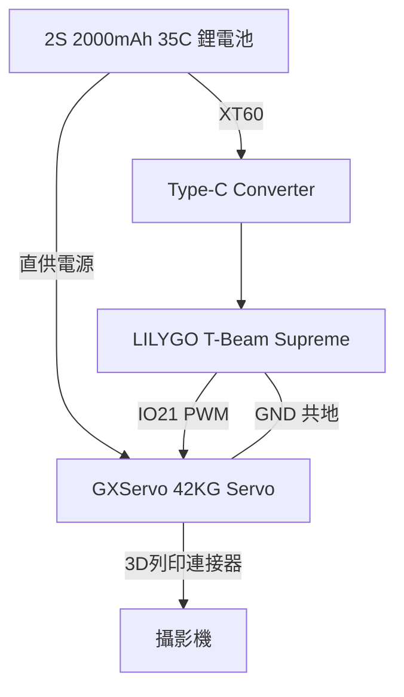

# 硬體說明（Hardware）

本文件彙整 Shore Spotter 的硬體規格與接線：

1. **腳位圖（Pins Map）** — T-Beam Supreme GPIO 分配
2. **I2C 裝置位址** — OLED / 感測器 / PMU
3. **電氣參數與電源通道** — AXP2101 各路供電
4. **按鈕說明** — PWR / BOOT / RST
5. **Servo 規格** — GXServo Brushless 42KG (QY3242BLS / GX3242)
6. **鏡頭指南針校正** — 磁針讀數、腳架固定與磁場干擾
7. **接線圖** — 電池直供 Servo / 攝影機（2026-09-09 使用者確認）

韌體行為見 [features.md](features.md)；封包/HTTP 介面見 [interface.md](interface.md)。

---

# LILYGO T-Beam Supreme - V3.0 / L76K / 915mhz / SX1262
### 📍 Pins Map

| Name                                         | GPIO NUM                   | Free |
| -------------------------------------------- | -------------------------- | ---- |
| Uart1 TX                                     | 43(External QWIIC Socket)  | ✅️    |
| Uart1 RX                                     | 44(External QWIIC Socket)  | ✅️    |
| SDA                                          | 17                         | ❌    |
| SCL                                          | 18                         | ❌    |
| OLED(**SH1106**) SDA                         | Share with I2C bus         | ❌    |
| OLED(**SH1106**) SCL                         | Share with I2C bus         | ❌    |
| RTC(**PCF8563**) SDA                         | Share with **PMU** I2C bus | ❌    |
| RTC(**PCF8563**) SCL                         | Share with **PMU** I2C bus | ❌    |
| MAG Sensor(**QMC6310U/QMC6310N/QC6309**) SDA | Share with I2C bus         | ❌    |
| MAG Sensor(**QMC6310U/QMC6310N/QC6309**) SCL | Share with I2C bus         | ❌    |
| RTC(**PCF8563**) Interrupt                   | 14                         | ❌    |
| IMU Sensor(**QMI8658**) Interrupt            | 33                         | ❌    |
| IMU Sensor(**QMI8658**) MISO                 | Share with SPI bus         | ❌    |
| IMU Sensor(**QMI8658**) MOSI                 | Share with SPI bus         | ❌    |
| IMU Sensor(**QMI8658**) SCK                  | Share with SPI bus         | ❌    |
| IMU Sensor(**QMI8658**) CS                   | 34                         | ❌    |
| SPI MOSI                                     | 35                         | ❌    |
| SPI MISO                                     | 37                         | ❌    |
| SPI SCK                                      | 36                         | ❌    |
| SD CS                                        | 47                         | ❌    |
| SD MOSI                                      | Share with SPI bus         | ❌    |
| SD MISO                                      | Share with SPI bus         | ❌    |
| SD SCK                                       | Share with SPI bus         | ❌    |
| GNSS(**L76K or Ublox M10**) TX               | 8                          | ❌    |
| GNSS(**L76K or Ublox M10**) RX               | 9                          | ❌    |
| GNSS(**L76K or Ublox M10**) PPS              | 6                          | ❌    |
| GNSS(**L76K**) Wake-up                       | 7                          | ❌    |
| LoRa(**SX1262 or LR1121**) SCK               | 12                         | ❌    |
| LoRa(**SX1262 or LR1121**) MISO              | 13                         | ❌    |
| LoRa(**SX1262 or LR1121**) MOSI              | 11                         | ❌    |
| LoRa(**SX1262 or LR1121**) RESET             | 5                          | ❌    |
| LoRa(**SX1262 or LR1121**) DIO1/DIO9         | 1                          | ❌    |
| LoRa(**SX1262 or LR1121**) BUSY              | 4                          | ❌    |
| LoRa(**SX1262 or LR1121**) CS                | 10                         | ❌    |
| Button1 (BOOT)                               | 0                          | ❌    |
| PMU (**AXP2101**) IRQ                        | 40                         | ❌    |
| PMU (**AXP2101**) SDA                        | 42                         | ❌    |
| PMU (**AXP2101**) SCL                        | 41                         | ❌    |

> \[!IMPORTANT]
> 
> 1. GNSS Wake-up is only available in L76K version
> 
> 2. Radio has its own SPI bus, and other peripheral SPI devices share the SPI bus.
>
> 3. T-BeamSupreme has three magnetometer versions: QMC6310N, QMC6310U, and QMC6309, each with a different device address.

### 🧑🏼‍🔧 I2C Devices Address

| Devices                                 | 7-Bit Address | Share Bus      |
| --------------------------------------- | ------------- | -------------- |
| OLED Display (**SH1106**)               | 0x3C/0x3D     | ✅️  (I2C Bus 0) |
| MAG Sensor(**QMC6310U OR QMC6310N**)    | 0x1C/0x3C     | ✅️  (I2C Bus 0) |
| MAG Sensor(**QMC6309**)                 | 0x7C          | ✅️  (I2C Bus 0) |
| Temperature/humidity Sensor(**BME280**) | 0x77          | ✅️  (I2C Bus 0) |
| RTC (**PCF8563**)                       | 0x51          | ❌ (I2C Bus 1)  |
| Power Manager (**AXP2101**)             | 0x34          | ❌ (I2C Bus 1)  |

> \[!IMPORTANT]
> If the I2C device is connected to pins 17 (SDA) or 18 (SCL)
> the sensor power supply must be connected to DC1. If connected to other LDOs
> the power must be turned on before accessing the sensor I2C bus
> otherwise, the I2C access will fail or freeze.
>
> The QMC6310U and QMC6310N use different device addresses: QMC6310U (0x1C) and QMC6310N (0x3C).
> The SH1106 uses either device address 0x3C or 0x3D. If using the QMC6310U version, the device address is 0x3C; if using the QMC6310N version, the device address is 0x3D.
> The screen device address using the QMC6309 magnetic sensor is 0x3C, the same as the QMC6310U.
>

> [!NOTE]
> **OLED 位址獨立偵測。** `detectOledAddress()` 先檢查 0x3D，存在就使用，否則選 0x3C；
> 不再靠磁力計初始化判定。這保留不同板子版本的螢幕支援，無需使用板上磁力計。

### BME280 Address

* If you need to change the BME280 device address, you can remove the resistor and then connect it to the fixed pad via a wire. This will change the device address to 0x76.

### ⚡ Electrical parameters

| Features             | Details                     |
| -------------------- | --------------------------- |
| 🔗USB-C Input Voltage | 3.9V-6V                     |
| ⚡Charge Current      | 0-1024mA (\(Programmable\)) |
| 🔋Battery Voltage     | 3.7V                        |

### ⚡ PowerManage Channel

| Channel    | Peripherals                              | Max Current                              |
| ---------- | ---------------------------------------- | ---------------------------------------- |
| DC1        | **ESP32-S3**                             | 2A(Includes ESP operating current 800mA) |
| DC2        | Unused                                   | X                                        |
| DC3        | External M.2 Socket                      | 2A                                       |
| DC4        | External M.2 Socket                      | 1.5A                                     |
| DC5        | External M.2 Socket                      | 1A                                       |
| LDO1(VRTC) | Unused                                   | X                                        |
| ALDO1      | **BME280 Sensor & Display & MAG Sensor** | 300mA                                    |
| ALDO2      | **Sensor**                               | 300mA                                    |
| ALDO3      | **Radio**                                | 300mA                                    |
| ALDO4      | **GPS**                                  | 300mA                                    |
| BLDO1      | **SD Card**                              | 300mA                                    |
| BLDO2      | External pin header                      | 300mA                                    |
| DLDO1      | Unused                                   | X                                        |
| CPUSLDO    | Unused                                   | X                                        |
| VBACKUP    | Unused                                   | X                                        |

* T-Beam Supreme GPS backup power comes from 18650 battery. If you remove the 18650 battery, you will not be able to get GPS hot start. If you need to use GPS hot start, please connect the 18650 battery.

### Button Description

| Channel | Peripherals                       |
| ------- | --------------------------------- |
| PWR     | PMU button, customizable function |
| BOOT    | Boot mode button, customizable    |
| RST     | Reset button                      |

* The PWR button is connected to the PMU
  1. In shutdown mode, press the PWR button to turn on the power supply
  2. In power-on mode, press the PWR button for 6 seconds (default time) to turn off the power supply

> 韌體用法（本專案）：Client 端**短按 PWR** 喚醒 OLED 顯示狀態 10 秒；**長按 PWR** 顯示關機畫面後由 PMU 斷電。Server 端長按 PWR 同樣為關機。

# GXServo Brushless 42KG (QY3242BLS / GX3242)

> 本專案目前使用：**500–2500us, 180°**（與韌體 `SERVO_MIN_US=500`, `SERVO_MAX_US=2500` 對應）。

> [!IMPORTANT]
> **旋轉方向：實機已確認為「角度增加 = 從上方看逆時針」**，與韌體追蹤公式的假設一致
> （`true_bearing = mount_offset + declination − servo_angle`，見 `main.cpp` 幾何註解）。
>
> 鏡頭校正只存 RAM；舊 NVS 安裝偏移不再沿用。
> 若日後把 servo 上下顛倒重裝，方向會反轉，追蹤會往錯的方向跑（surfer 往左、鏡頭往右），
> 而且**不會有任何錯誤訊息**。重裝機構後請務必重驗：
>
> 手動模式把滑桿從 90 拉到 120，從上方看相機應該**逆時針**轉。若變成順時針，
> 就要先修正安裝方向或控制幾何，再重新用鏡頭指南針校正；目前校正僅存 RAM，
> 已無 `SERVO_CAL_VERSION` 或校正 NVS 版本需要更新。

| Parameter | Value |
| --- | --- |
| 型號 | GXServo QY3242BLS / GX3242（42KG 級） |
| 馬達型式 | Brushless |
| 操作電壓 | 5.0V–8.4V |
| 控制訊號 | PWM, 1520us / 333Hz（常見標示） |
| PWM 輸入電平 | 3.3V–5.0V |
| 脈寬/角度 | 500–2500us 對應 180° |
| 堵轉扭力 | 30 kg.cm @ 6.0V / 38 kg.cm @ 7.4V / 42 kg.cm @ 8.4V |
| 空載速度 | 0.118s/60° @ 6.0V / 0.092s/60° @ 7.4V / 0.085s/60° @ 8.4V |
| Dead band | 2us |
| 防護 | IP65（依賣場標示） |
| 齒輪/軸承 | 金屬齒輪（常見為銅鋁組合）/ 雙滾珠 |
| 尺寸/重量 | 約 40 x 20 x 37mm / 約 69g |
| 線材 | Brown(-) / Red(+) / Orange(Signal) |

> [!IMPORTANT]
> 1. GXServo 42KG 在不同通路會有標示差異（例如殼材、齒輪材質、是否可程式化、角度選項）。
> 2. 本專案以 **180° 版本 + 500–2500us** 為準，若你買到 270/360° 版本，需重新校正行程。
> 3. 目前使用者確認 Servo 直接 **2S、2000 mAh、35C 電池**，不經 UBEC。一般 2S LiPo 充滿為
>    8.4 V，直供必須以實際 Servo 銘牌／規格支援該電壓為前提；本表通路規格不能代替實物核對。
> 4. Servo Brown(-)、電池負極與 T-Beam GND 必須共地；只接 IO21 訊號線無法形成有效的 PWM 電位基準。

資料來源（2026-07-23 查詢）：
- https://www.ariesrc.gr/en/servo-4/22326-gxservo-qy3242bls-42kg-brushless-motor-180-degree-metal-gear-digital-servo-for-rc.html
- https://hobbyant.com/p/sale-268576
- https://offthegridsun.com/Servo-Robot-Motor/GXservo-GX3242-42KG-Brushless-Steering-Gear-High-Speed-Servo

# 鏡頭指南針校正

目前只使用黏在鏡頭上的普通磁針指南針；韌體不初始化／取樣板上 QMC，不做 hard-iron，
也不保存板上校正到 NVS。上方表格仍記錄板子實際裝有的元件與位址。

手動時輸入北 0°、東 90°等讀數，RAM 保存 `mount_offset = compass_bearing + servo_angle`。
GPS 追蹤以 `servo_angle = mount_offset + declination - true_bearing` 計算，維持原本
Servo 角度增加為逆時針的方向；台灣磁偏角依 GPS 位置／日期自動換算。

指南針需與鏡頭光軸朝向對齊。腳架轉動、重新架設、移動指南針或重開機後必須重校。
若磁針讀數隨 Servo 上電／轉動明顯變化，先拉開指南針與馬達／金屬的距離。
UART 只傳 Servo 絕對角度，不要求 GPS 或指南針校正。

# 接線圖

```mermaid
flowchart TD
    B[2S 2000mAh 35C 鋰電池]

    B -->|XT60| C[Type-C Converter]
    B -->|直供電源| S[GXServo 42KG Servo]
    C --> T[LILYGO T-Beam Supreme]
    T -->|IO21 PWM| S
    T ---|GND 共地| S
    S -->|3D列印連接器| A[攝影機]

```

Servo 直供為 2026-09-09 使用者確認；2000 mAh × 35C 對應標稱 70 A，並非實測
持續輸出保證。線徑／長度、接頭、電池健康度與移動時電壓尚未量測。
使用者回報移動時抖動，固定時也偶爾抖一下；控制模式與抖動當下命令角度尚未核對。
抖動排查先量 Servo 電源接頭的動態電壓，再比較減輕負載與降低共用速限的結果；
保持角度時仍抖，也要檢查共地、訊號與 Servo 自身的定位修正。軟體限速無法
消除 Servo 內部的保持修正或機構共振。
電源需同時滿足 Servo 的電壓與電流要求，參考
[Pololu 供電說明](https://www.pololu.com/docs/0J40/7.a)；一般 2S LiPo 與 LiHV 充滿
電壓不同，參考 [Gens ace 電池說明](https://genstattu.com/blog/how-to-choose-the-best-2s-shorty-lipo-pack)。

## 電源與電量量測

- **Server**：2S 經 Type-C 變壓供 USB-C（PMU 視為 VBUS），同時板載 **18650** 作備援 → 像手機插著電使用。
- **Client**：板載 **18650** 單獨供電。
- 板上 **AXP2101 只量得到 18650（單 cell）**；2S 無法直接讀（對 Server 只是 VBUS）。
- 電量 %：**3.2V=0%、4.15V=100%**（線性）。低於 3.2V 自動關機；**接 USB（VBUS 在）時不關機**，Type-C 失效改吃 18650 過低才關（保險）。
- 接 USB/Type-C 時 OLED 與網頁顯示 **⚡**；「插著 Type-C 仍回報 18650 電壓」為正常。
- 18650 為 LilyGO 板載電池，亦是 GPS 熱啟動備援電源。

## UART 控制

使用 3.3 V USB-to-TTL：TX 接 GPIO44、RX 接 GPIO43，共地，獨立供電時不接 VCC。
UART2 為 115200 8N1，與 GPS 的 UART1（GPIO9/8）分開。控制規則見
[uart-servo.md](uart-servo.md)。鏡頭上的磁針指南針跟著鏡頭轉；板上 QMC 不參與控制。
